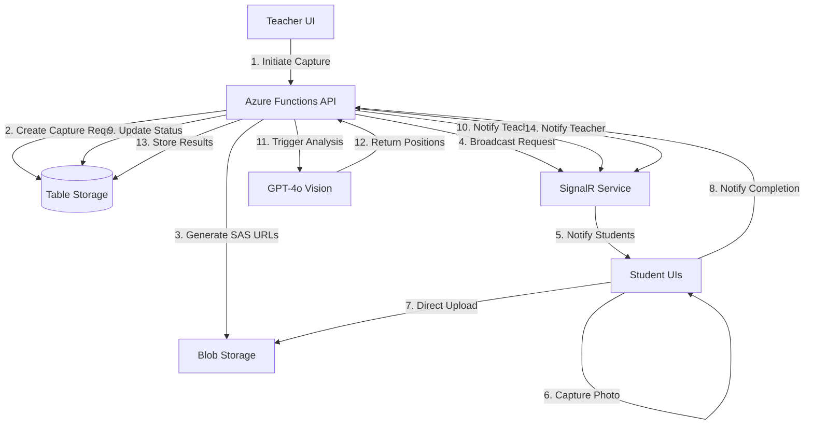
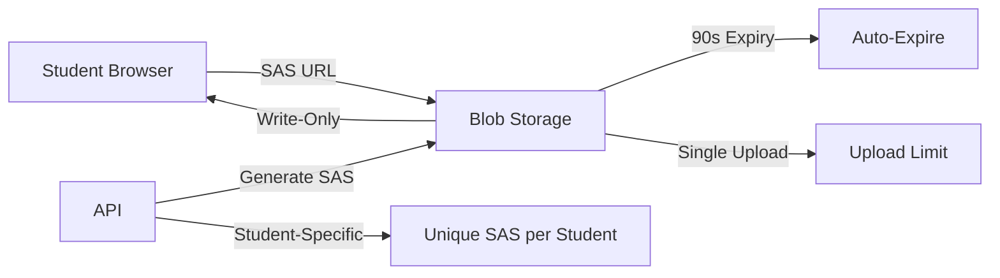

# Design Document: Student Image Capture and Seating Position Estimation

## Overview

This feature enables teachers to capture student photos during online sessions and estimate their seating positions using AI analysis. The system provides a real-time photo capture workflow where teachers trigger capture requests, students upload photos directly to Azure Blob Storage within a 30-second window, and GPT analyzes the collected images to estimate seating positions based on projector visibility.

### Key Design Decisions

1. **Direct Browser Upload**: Students upload images directly to Azure Blob Storage using SAS URLs, bypassing the backend to reduce latency and server load
2. **Time-Limited Capture**: 30-second capture window ensures timely completion while providing sufficient time for students to respond
3. **SignalR Real-Time Communication**: Leverages existing SignalR infrastructure for instant notification delivery
4. **GPT-Based Position Estimation**: Uses GPT vision capabilities to analyze projector visibility in backgrounds for seating position inference
5. **Session Integration**: Capture requests are tightly integrated with existing session management for seamless workflow

### Technology Stack

- **Backend**: Azure Functions (TypeScript)
- **Frontend**: React/Next.js
- **Real-time**: Azure SignalR Service
- **Storage**: Azure Blob Storage with SAS URLs
- **AI**: Azure OpenAI GPT-4o (vision-enabled)
- **Database**: Azure Table Storage

## Architecture

### High-Level Architecture



### Component Interaction Flow

1. **Capture Initiation**: Teacher clicks capture button → API creates capture request → Generates unique SAS URLs for each online student
2. **Student Notification**: SignalR broadcasts capture request with SAS URL to all online students
3. **Photo Upload**: Students capture photo → Validate size (≤1MB) → Upload directly to Blob Storage using SAS URL
4. **Upload Tracking**: Students notify API of completion → API tracks upload status
5. **Timeout Handling**: 30-second timer expires → API stops accepting uploads → Collects all uploaded images
6. **Position Analysis**: API sends all images to GPT → GPT analyzes projector visibility → Returns estimated positions
7. **Result Delivery**: API stores results → Broadcasts to teacher via SignalR

### Security Architecture



- SAS URLs are student-specific and single-use
- Write-only permissions prevent reading other students' photos
- 90-second expiry (30s window + 60s grace period)
- Blob naming includes sessionId and studentId for isolation

## Components and Interfaces

### Backend Components

#### 1. Capture Request Function (`initiateImageCapture`)

**Purpose**: Create capture request and broadcast to students

**HTTP Endpoint**: `POST /api/sessions/{sessionId}/capture/initiate`

**Authentication**: Teacher role required

**Request Body**:
```typescript
{
  // No body required - uses sessionId from route
}
```

**Response**:
```typescript
{
  captureRequestId: string;
  expiresAt: number; // Unix timestamp
  onlineStudentCount: number;
}
```

**Logic**:
1. Validate teacher authentication and session ownership
2. Query online students from Attendance table
3. Generate unique captureRequestId
4. Create SAS URLs for each online student
5. Store capture request in CaptureRequests table
6. Broadcast captureRequest event via SignalR to all students
7. Start 30-second timer (handled by separate timer function)

#### 2. Upload Notification Function (`notifyImageUpload`)

**Purpose**: Track student upload completion

**HTTP Endpoint**: `POST /api/sessions/{sessionId}/capture/{captureRequestId}/upload`

**Authentication**: Student role required

**Request Body**:
```typescript
{
  blobName: string; // Verification that upload completed
}
```

**Response**:
```typescript
{
  success: boolean;
  uploadedAt: number;
}
```

**Logic**:
1. Validate student authentication
2. Verify captureRequestId is still active (within 30s window)
3. Verify blob exists in storage
4. Update CaptureUploads table with upload record
5. Broadcast uploadComplete event to teacher via SignalR

#### 3. Capture Timeout Function (`processCaptureTimeout`)

**Purpose**: Handle capture window expiration and trigger analysis

**Trigger**: Timer trigger (runs every 10 seconds, checks for expired captures)

**Logic**:
1. Query CaptureRequests table for requests with expiresAt < now
2. For each expired request:
   - Mark status as 'ANALYZING'
   - Query CaptureUploads for all uploaded images
   - Broadcast captureExpired event to all students
   - Trigger position estimation
   - Update status to 'COMPLETED' or 'FAILED'
   - Broadcast results to teacher

#### 4. Position Estimation Function (`estimateSeatingPositions`)

**Purpose**: Analyze images using GPT to estimate seating positions

**Internal Function** (called by processCaptureTimeout)

**Input**:
```typescript
{
  captureRequestId: string;
  imageUrls: Array<{
    studentId: string;
    blobUrl: string;
  }>;
}
```

**Output**:
```typescript
{
  positions: Array<{
    studentId: string;
    estimatedRow: number; // 1-based row number
    estimatedColumn: number; // 1-based column number
    confidence: 'HIGH' | 'MEDIUM' | 'LOW';
    reasoning: string;
  }>;
  analysisNotes: string;
}
```

**Logic**:
1. Generate SAS URLs with read permissions for GPT access
2. Construct GPT prompt with all image URLs
3. Call GPT-4o vision API with multi-image analysis
4. Parse GPT response for position estimates
5. Store results in CaptureResults table
6. Return structured position data

### Frontend Components

#### 1. Teacher Capture Control

**Location**: `TeacherDashboard.tsx` (new section)

**UI Elements**:
- "Capture Student Photos" button (enabled when session active and students online)
- Capture status indicator (idle, capturing, analyzing, completed)
- Timer display (30-second countdown)
- Upload progress (X/Y students uploaded)
- Results display (seating grid visualization)

**State Management**:
```typescript
interface CaptureState {
  status: 'idle' | 'capturing' | 'analyzing' | 'completed' | 'failed';
  captureRequestId: string | null;
  expiresAt: number | null;
  uploadedCount: number;
  totalCount: number;
  results: SeatingPosition[] | null;
  error: string | null;
}
```

**SignalR Events Handled**:
- `captureRequest` (echo for confirmation)
- `uploadComplete` (increment counter)
- `captureExpired` (show analyzing state)
- `captureResults` (display seating positions)

#### 2. Student Capture Interface

**Location**: `SimpleStudentView.tsx` (new modal/section)

**UI Elements**:
- Capture button (conditionally visible)
- Camera access prompt
- Photo preview
- Upload progress indicator
- Success/error messages
- Timer display

**State Management**:
```typescript
interface StudentCaptureState {
  isVisible: boolean;
  captureRequestId: string | null;
  sasUrl: string | null;
  expiresAt: number | null;
  photo: Blob | null;
  uploadStatus: 'idle' | 'uploading' | 'success' | 'error';
  errorMessage: string | null;
}
```

**SignalR Events Handled**:
- `captureRequest` (show capture UI, store SAS URL)
- `captureExpired` (hide capture UI)

**Upload Flow**:
1. User clicks capture button
2. Request camera access via `navigator.mediaDevices.getUserMedia()`
3. Display camera preview
4. User takes photo
5. Validate file size ≤ 1MB (compress if needed)
6. Upload directly to Blob Storage using SAS URL
7. Call notifyImageUpload API
8. Hide capture UI

## Data Models

### CaptureRequests Table

**Partition Key**: `CAPTURE_REQUEST`
**Row Key**: `{captureRequestId}`

```typescript
interface CaptureRequest {
  partitionKey: 'CAPTURE_REQUEST';
  rowKey: string; // captureRequestId (UUID)
  sessionId: string;
  teacherId: string;
  status: 'ACTIVE' | 'EXPIRED' | 'ANALYZING' | 'COMPLETED' | 'FAILED';
  createdAt: string; // ISO timestamp
  expiresAt: string; // ISO timestamp (createdAt + 30s)
  onlineStudentIds: string; // JSON array of student IDs
  onlineStudentCount: number;
  uploadedCount: number;
  analysisStartedAt?: string;
  analysisCompletedAt?: string;
  errorMessage?: string;
}
```

### CaptureUploads Table

**Partition Key**: `{captureRequestId}`
**Row Key**: `{studentId}`

```typescript
interface CaptureUpload {
  partitionKey: string; // captureRequestId
  rowKey: string; // studentId
  sessionId: string;
  blobName: string; // captures/{sessionId}/{captureRequestId}/{studentId}.jpg
  blobUrl: string;
  uploadedAt: string; // ISO timestamp
  fileSizeBytes: number;
}
```

### CaptureResults Table

**Partition Key**: `{captureRequestId}`
**Row Key**: `RESULT`

```typescript
interface CaptureResult {
  partitionKey: string; // captureRequestId
  rowKey: 'RESULT';
  sessionId: string;
  positions: string; // JSON array of SeatingPosition objects
  analysisNotes: string;
  analyzedAt: string; // ISO timestamp
  gptModel: string; // e.g., "gpt-4o"
  gptTokensUsed: number;
}

interface SeatingPosition {
  studentId: string;
  estimatedRow: number;
  estimatedColumn: number;
  confidence: 'HIGH' | 'MEDIUM' | 'LOW';
  reasoning: string;
}
```

### Blob Storage Structure

**Container**: `student-captures`

**Blob Naming Convention**: `{sessionId}/{captureRequestId}/{studentId}.jpg`

**Example**: `a1b2c3d4-e5f6-7890-abcd-ef1234567890/f9e8d7c6-b5a4-3210-9876-543210fedcba/student@stu.vtc.edu.hk.jpg`

**Blob Metadata**:
- `sessionId`: Session identifier
- `captureRequestId`: Capture request identifier
- `studentId`: Student email
- `uploadedAt`: ISO timestamp

## API Endpoints

### 1. Initiate Capture Request

```
POST /api/sessions/{sessionId}/capture/initiate
```

**Authentication**: Teacher role required

**Path Parameters**:
- `sessionId`: UUID of the session

**Response 201**:
```json
{
  "captureRequestId": "f9e8d7c6-b5a4-3210-9876-543210fedcba",
  "expiresAt": 1704067230000,
  "onlineStudentCount": 25
}
```

**Response 400**: Invalid session or no online students
**Response 401**: Unauthorized
**Response 403**: Not a teacher or not session owner
**Response 500**: Internal error

### 2. Notify Upload Completion

```
POST /api/sessions/{sessionId}/capture/{captureRequestId}/upload
```

**Authentication**: Student role required

**Path Parameters**:
- `sessionId`: UUID of the session
- `captureRequestId`: UUID of the capture request

**Request Body**:
```json
{
  "blobName": "a1b2c3d4.../f9e8d7c6.../student@stu.vtc.edu.hk.jpg"
}
```

**Response 200**:
```json
{
  "success": true,
  "uploadedAt": 1704067215000
}
```

**Response 400**: Invalid request or capture expired
**Response 401**: Unauthorized
**Response 404**: Capture request not found
**Response 500**: Internal error

### 3. Get Capture Results

```
GET /api/sessions/{sessionId}/capture/{captureRequestId}/results
```

**Authentication**: Teacher role required

**Path Parameters**:
- `sessionId`: UUID of the session
- `captureRequestId`: UUID of the capture request

**Response 200**:
```json
{
  "captureRequestId": "f9e8d7c6-b5a4-3210-9876-543210fedcba",
  "status": "COMPLETED",
  "uploadedCount": 23,
  "totalCount": 25,
  "positions": [
    {
      "studentId": "student1@stu.vtc.edu.hk",
      "estimatedRow": 2,
      "estimatedColumn": 3,
      "confidence": "HIGH",
      "reasoning": "Clear projector visibility in background, centered position"
    }
  ],
  "analysisNotes": "Analysis based on projector screen visibility and relative positions",
  "analyzedAt": "2024-01-01T12:00:45.000Z"
}
```

**Response 202**: Analysis in progress
**Response 401**: Unauthorized
**Response 403**: Not authorized to view results
**Response 404**: Capture request not found
**Response 500**: Internal error

## SignalR Events

### Hub Name

`dashboard{sessionId}` (existing pattern, sessionId with hyphens removed)

### Events Sent to Students

#### 1. captureRequest

**Payload**:
```typescript
{
  captureRequestId: string;
  sasUrl: string; // Student-specific SAS URL
  expiresAt: number; // Unix timestamp
  blobName: string; // Expected blob name for upload
}
```

**Trigger**: Teacher initiates capture request

**Student Action**: Show capture UI, enable camera access

#### 2. captureExpired

**Payload**:
```typescript
{
  captureRequestId: string;
}
```

**Trigger**: 30-second capture window expires

**Student Action**: Hide capture UI, disable upload

### Events Sent to Teacher

#### 1. uploadComplete

**Payload**:
```typescript
{
  captureRequestId: string;
  studentId: string;
  uploadedAt: number;
  uploadedCount: number;
  totalCount: number;
}
```

**Trigger**: Student completes upload

**Teacher Action**: Update progress counter

#### 2. captureExpired

**Payload**:
```typescript
{
  captureRequestId: string;
  uploadedCount: number;
  totalCount: number;
}
```

**Trigger**: 30-second capture window expires

**Teacher Action**: Show "Analyzing..." status

#### 3. captureResults

**Payload**:
```typescript
{
  captureRequestId: string;
  status: 'COMPLETED' | 'FAILED';
  positions?: SeatingPosition[];
  analysisNotes?: string;
  errorMessage?: string;
}
```

**Trigger**: GPT analysis completes

**Teacher Action**: Display seating grid or error message

## Blob Storage Integration

### SAS URL Generation

**Function**: `generateStudentSasUrl(sessionId, captureRequestId, studentId)`

**Permissions**: Write only (`w`)

**Expiry**: 90 seconds (30s window + 60s grace period)

**Blob Name**: `{sessionId}/{captureRequestId}/{studentId}.jpg`

**Implementation**:
```typescript
import { BlobServiceClient, generateBlobSASQueryParameters, BlobSASPermissions, StorageSharedKeyCredential } from '@azure/storage-blob';

function generateStudentSasUrl(
  sessionId: string,
  captureRequestId: string,
  studentId: string
): string {
  const connectionString = process.env.AzureWebJobsStorage!;
  const blobServiceClient = BlobServiceClient.fromConnectionString(connectionString);
  const containerName = 'student-captures';
  const blobName = `${sessionId}/${captureRequestId}/${studentId}.jpg`;
  
  const containerClient = blobServiceClient.getContainerClient(containerName);
  const blockBlobClient = containerClient.getBlockBlobClient(blobName);
  
  // Extract account name and key from connection string
  const accountNameMatch = connectionString.match(/AccountName=([^;]+)/);
  const accountKeyMatch = connectionString.match(/AccountKey=([^;]+)/);
  
  if (!accountNameMatch || !accountKeyMatch) {
    throw new Error('Invalid storage connection string');
  }
  
  const sharedKeyCredential = new StorageSharedKeyCredential(
    accountNameMatch[1],
    accountKeyMatch[1]
  );
  
  const sasToken = generateBlobSASQueryParameters(
    {
      containerName,
      blobName,
      permissions: BlobSASPermissions.parse('w'), // Write only
      startsOn: new Date(),
      expiresOn: new Date(Date.now() + 90000), // 90 seconds
    },
    sharedKeyCredential
  ).toString();
  
  return `${blockBlobClient.url}?${sasToken}`;
}
```

### Client-Side Upload

**Implementation** (Frontend):
```typescript
async function uploadImageToBlob(
  photo: Blob,
  sasUrl: string
): Promise<void> {
  const response = await fetch(sasUrl, {
    method: 'PUT',
    headers: {
      'x-ms-blob-type': 'BlockBlob',
      'Content-Type': 'image/jpeg',
    },
    body: photo,
  });
  
  if (!response.ok) {
    throw new Error(`Upload failed: ${response.status}`);
  }
}
```

## GPT Integration

### Position Estimation Prompt

**System Prompt**:
```
You are an AI assistant that analyzes classroom photos to estimate student seating positions. You will receive multiple photos taken by students during an online class session. Each photo shows the student's view of the classroom, potentially including the projector screen or whiteboard in the background.

Your task is to estimate the relative seating position of each student based on:
1. Projector screen visibility and angle
2. Projector screen size in the frame
3. Classroom features visible in the background
4. Relative positions compared to other students' photos

Provide estimates as row and column numbers, with row 1 being closest to the projector and column 1 being leftmost from the teacher's perspective.
```

**User Prompt Template**:
```
Analyze these ${imageCount} student photos and estimate their seating positions:

${images.map((img, i) => `Student ${i + 1} (ID: ${img.studentId}): [Image URL]`).join('\n')}

Respond in JSON format:
{
  "positions": [
    {
      "studentId": "student@email.com",
      "estimatedRow": 2,
      "estimatedColumn": 3,
      "confidence": "HIGH" | "MEDIUM" | "LOW",
      "reasoning": "Brief explanation"
    }
  ],
  "analysisNotes": "Overall observations about the classroom layout"
}

Consider:
- Students with larger projector screens are likely closer to the front
- Students with similar viewing angles are likely in the same row
- Projector position and angle indicate column position
- If projector is not visible, confidence should be LOW
```

### API Call Implementation

```typescript
async function estimateSeatingPositions(
  captureRequestId: string,
  images: Array<{ studentId: string; blobUrl: string }>
): Promise<CaptureResult> {
  const openaiEndpoint = process.env.AZURE_OPENAI_ENDPOINT!;
  const openaiKey = process.env.AZURE_OPENAI_KEY!;
  const deployment = process.env.AZURE_OPENAI_DEPLOYMENT || 'gpt-4o';
  
  // Generate read SAS URLs for GPT access
  const imageUrls = images.map(img => ({
    studentId: img.studentId,
    url: generateReadSasUrl(img.blobUrl), // 5-minute read access
  }));
  
  const apiUrl = `${openaiEndpoint}/openai/deployments/${deployment}/chat/completions?api-version=2024-08-01-preview`;
  
  const messages = [
    {
      role: 'system',
      content: 'You are an AI assistant that analyzes classroom photos...',
    },
    {
      role: 'user',
      content: [
        {
          type: 'text',
          text: `Analyze these ${images.length} student photos...`,
        },
        ...imageUrls.map(img => ({
          type: 'image_url',
          image_url: { url: img.url },
        })),
      ],
    },
  ];
  
  const response = await fetch(apiUrl, {
    method: 'POST',
    headers: {
      'Content-Type': 'application/json',
      'api-key': openaiKey,
    },
    body: JSON.stringify({
      messages,
      max_tokens: 2000,
      temperature: 0.3,
    }),
  });
  
  if (!response.ok) {
    throw new Error(`GPT API error: ${response.status}`);
  }
  
  const result = await response.json();
  const content = result.choices[0]?.message?.content;
  
  // Parse JSON response
  const jsonMatch = content.match(/```json\n([\s\S]*?)\n```/) || 
                    content.match(/```\n([\s\S]*?)\n```/);
  const jsonStr = jsonMatch ? jsonMatch[1] : content;
  const analysis = JSON.parse(jsonStr);
  
  return {
    partitionKey: captureRequestId,
    rowKey: 'RESULT',
    sessionId: '', // Set by caller
    positions: JSON.stringify(analysis.positions),
    analysisNotes: analysis.analysisNotes,
    analyzedAt: new Date().toISOString(),
    gptModel: deployment,
    gptTokensUsed: result.usage?.total_tokens || 0,
  };
}
```

### Error Handling

- **No images uploaded**: Return error, don't call GPT
- **GPT API failure**: Retry once, then mark as FAILED
- **Invalid JSON response**: Log raw response, mark as FAILED
- **Timeout**: 60-second timeout for GPT call

## Security Considerations

### Authentication and Authorization

1. **Teacher Actions**:
   - Initiate capture: Requires teacher role + session ownership
   - View results: Requires teacher role + session ownership

2. **Student Actions**:
   - Upload photo: Requires student role + active session participation
   - SAS URL is student-specific, cannot be used by others

### SAS URL Security

1. **Write-Only Permissions**: Students can only upload, not read or list blobs
2. **Time-Limited**: 90-second expiry prevents replay attacks
3. **Single-Use Intent**: Blob name includes studentId, preventing multiple uploads to same location
4. **No List Permission**: Students cannot enumerate other blobs in container

### Data Privacy

1. **Blob Isolation**: Each capture request uses unique subfolder
2. **Access Control**: Only session teacher can retrieve results
3. **Retention Policy**: Consider implementing blob lifecycle policy to auto-delete after X days
4. **Student Consent**: UI should include consent message before camera access

### Input Validation

1. **File Size**: Frontend validates ≤1MB before upload
2. **File Type**: Accept only image/jpeg, image/png
3. **Blob Verification**: Backend verifies blob exists before recording upload
4. **Timeout Enforcement**: Reject uploads after capture window expires


## Correctness Properties

A property is a characteristic or behavior that should hold true across all valid executions of a system—essentially, a formal statement about what the system should do. Properties serve as the bridge between human-readable specifications and machine-verifiable correctness guarantees.

### Property 1: Broadcast Delivery to All Online Students

For any capture request initiated by a teacher, all students marked as online in the session SHALL receive the capture request via SignalR broadcast.

**Validates: Requirements 1.1, 7.1**

### Property 2: Capture Window Duration

For any capture request, the expiration timestamp (expiresAt) SHALL be exactly 30 seconds after the creation timestamp (createdAt).

**Validates: Requirements 1.2, 5.1**

### Property 3: Multiple Capture Requests Per Session

For any session, the system SHALL allow creation of multiple capture requests, each with a unique captureRequestId.

**Validates: Requirements 1.3**

### Property 4: SAS URL Uniqueness

For any capture request with N online students, the system SHALL generate N distinct SAS URLs, where each URL is unique and student-specific.

**Validates: Requirements 1.4, 9.1**

### Property 5: Capture Button Visibility on Request

For any student who receives a captureRequest event, the capture button SHALL become visible in the UI.

**Validates: Requirements 2.1**

### Property 6: Capture Button Hidden After Upload

For any student who successfully completes an image upload, the capture button SHALL be hidden from that student's UI.

**Validates: Requirements 2.4**

### Property 7: Direct Blob Upload Success

For any valid image (≤1MB) and valid SAS URL, uploading the image directly to Azure Blob Storage SHALL succeed and the blob SHALL exist at the specified location.

**Validates: Requirements 3.1**

### Property 8: Upload Completion Notification

For any successful image upload to blob storage, the student client SHALL call the notifyImageUpload API endpoint.

**Validates: Requirements 3.3**

### Property 9: Upload Failure Error Display

For any failed upload attempt, the system SHALL display an error message to the student.

**Validates: Requirements 3.4**

### Property 10: Image Size Validation

For any image selected by a student, the system SHALL validate that the file size does not exceed 1MB before allowing upload.

**Validates: Requirements 4.1**

### Property 11: Oversized Image Rejection

For any image exceeding 1MB, the system SHALL display an error message AND prevent the upload from starting.

**Validates: Requirements 4.2, 4.3**

### Property 12: Post-Expiration Upload Rejection

For any upload attempt made after the capture window has expired, the system SHALL reject the upload with a timeout error message.

**Validates: Requirements 5.2, 5.4**

### Property 13: Teacher Notification on Expiration

For any capture request whose capture window expires, the system SHALL send a completion status notification to the teacher via SignalR.

**Validates: Requirements 5.3**

### Property 14: Analysis Trigger on Completion

For any capture request where either all expected uploads are complete OR the capture window expires, the system SHALL initiate GPT analysis of the collected images.

**Validates: Requirements 6.1**

### Property 15: Results Delivery to Teacher

For any completed position estimation analysis, the system SHALL store the results in the database AND broadcast them to the teacher via SignalR.

**Validates: Requirements 6.3**

### Property 16: Analysis Failure Notification

For any GPT analysis that fails, the system SHALL notify the teacher with an error message via SignalR.

**Validates: Requirements 6.4**

### Property 17: Upload Notification via SignalR

For any student photo upload, the system SHALL send a real-time notification to the teacher using SignalR.

**Validates: Requirements 7.2**

### Property 18: Expiration Notification via SignalR

For any capture window expiration, the system SHALL send real-time notifications to all participants (teacher and students) using SignalR.

**Validates: Requirements 7.3**

### Property 19: Session Association

For any capture request, the system SHALL store the sessionId with all related data (capture request, uploads, results).

**Validates: Requirements 8.2, 8.3**

### Property 20: Historical Data Retrieval

For any completed capture request, the system SHALL allow retrieval of the capture data and results via the API.

**Validates: Requirements 8.4**

### Property 21: SAS URL Expiration Time

For any generated SAS URL, the expiration time SHALL be set to 90 seconds (30-second capture window + 60-second grace period) from the time of generation.

**Validates: Requirements 9.2**

### Property 22: SAS URL Write-Only Permissions

For any generated SAS URL, the permissions SHALL be set to write-only, preventing read or list operations.

**Validates: Requirements 9.3**

### Property 23: Student-Specific Blob Names

For any generated SAS URL, the blob name SHALL include the studentId, ensuring each student can only upload to their own designated blob location.

**Validates: Requirements 9.4**


## Error Handling

### Client-Side Errors

#### Camera Access Denied
- **Scenario**: User denies camera permission
- **Handling**: Display friendly message: "Camera access is required to capture your photo. Please enable camera permissions in your browser settings."
- **Recovery**: Provide retry button, link to browser help documentation

#### Image Too Large
- **Scenario**: Captured/selected image exceeds 1MB
- **Handling**: 
  1. Attempt automatic compression using canvas API
  2. If compression fails or result still >1MB, show error: "Image is too large. Please try again with lower quality or different camera."
- **Recovery**: Allow user to retake photo or select different image

#### Upload Failure
- **Scenario**: Network error, SAS URL expired, or blob service unavailable
- **Handling**: 
  1. Retry once automatically after 2-second delay
  2. If retry fails, show error: "Upload failed. Please check your connection and try again."
- **Recovery**: Keep photo in memory, allow manual retry within capture window

#### Timeout
- **Scenario**: Student attempts upload after 30-second window
- **Handling**: Show error: "Time expired. The capture window has closed."
- **Recovery**: No recovery - capture window is closed

#### SignalR Disconnection
- **Scenario**: SignalR connection drops during capture
- **Handling**: 
  1. Attempt automatic reconnection (built into SignalR)
  2. If reconnection fails, fall back to HTTP polling for status
  3. Show warning: "Connection unstable. Your upload may be delayed."
- **Recovery**: Continue allowing upload via direct blob storage (doesn't require SignalR)

### Server-Side Errors

#### No Online Students
- **Scenario**: Teacher initiates capture but no students are online
- **Handling**: Return 400 error: "No online students available for capture"
- **UI Response**: Show message: "Cannot initiate capture - no students are currently online"

#### Session Not Found
- **Scenario**: Invalid sessionId in capture request
- **Handling**: Return 404 error with message: "Session not found"
- **UI Response**: Disable capture button, show error in dashboard

#### Unauthorized Access
- **Scenario**: Student attempts to access another student's capture data
- **Handling**: Return 403 error: "Access denied"
- **UI Response**: Show generic error, log security event

#### Blob Storage Unavailable
- **Scenario**: Azure Blob Storage service is down or unreachable
- **Handling**: 
  1. Retry with exponential backoff (3 attempts)
  2. If all retries fail, mark capture request as FAILED
  3. Notify teacher via SignalR
- **Recovery**: Teacher can retry capture request after service recovers

#### GPT API Failure
- **Scenario**: OpenAI API returns error or times out
- **Handling**:
  1. Retry once after 5-second delay
  2. If retry fails, mark analysis as FAILED
  3. Store uploaded images for manual review
  4. Notify teacher: "Position analysis failed. Images have been saved for manual review."
- **Recovery**: Provide manual retry button in teacher UI

#### GPT Response Parsing Error
- **Scenario**: GPT returns malformed JSON or unexpected format
- **Handling**:
  1. Log raw GPT response for debugging
  2. Mark analysis as FAILED
  3. Notify teacher with error details
- **Recovery**: Allow manual retry, potentially with adjusted prompt

#### Database Write Failure
- **Scenario**: Table Storage operation fails
- **Handling**:
  1. Retry with exponential backoff (3 attempts)
  2. If all retries fail, return 500 error
  3. Log error details for investigation
- **Recovery**: Automatic retry on next operation

### Error Logging

All errors SHALL be logged with the following information:
- Timestamp (ISO 8601)
- Error type/code
- Session ID
- Capture Request ID (if applicable)
- Student ID (if applicable)
- Error message
- Stack trace (server-side only)
- Request context (headers, body for debugging)

**Log Levels**:
- **ERROR**: Upload failures, GPT failures, database failures
- **WARN**: Timeouts, retries, SAS URL expiration
- **INFO**: Successful captures, analysis completion
- **DEBUG**: SignalR events, SAS URL generation

## Testing Strategy

### Unit Testing

Unit tests will focus on specific components and edge cases using Jest for both frontend and backend.

**Backend Unit Tests**:

1. **SAS URL Generation**:
   - Test URL format correctness
   - Test expiration time calculation (90 seconds)
   - Test write-only permissions
   - Test student-specific blob naming
   - Test with local Azurite and production storage

2. **Capture Request Creation**:
   - Test with valid session and online students
   - Test with no online students (error case)
   - Test with invalid session (error case)
   - Test multiple requests for same session

3. **Upload Notification**:
   - Test with valid upload within window
   - Test with expired capture request (rejection)
   - Test with non-existent blob (error)
   - Test with unauthorized student (error)

4. **Timeout Processing**:
   - Test identification of expired requests
   - Test status transitions (ACTIVE → ANALYZING → COMPLETED)
   - Test with zero uploads
   - Test with partial uploads

5. **GPT Integration**:
   - Test prompt construction with multiple images
   - Test JSON response parsing
   - Test error handling (API failure, timeout, malformed response)
   - Mock GPT API for deterministic testing

**Frontend Unit Tests**:

1. **Capture Button Visibility**:
   - Test button hidden by default
   - Test button shown on captureRequest event
   - Test button hidden after upload
   - Test button hidden on expiration

2. **Image Validation**:
   - Test size validation (≤1MB pass, >1MB fail)
   - Test file type validation
   - Test compression logic

3. **Upload Logic**:
   - Test blob upload with valid SAS URL (mocked)
   - Test retry on failure
   - Test timeout handling
   - Test API notification call

4. **Timer Display**:
   - Test countdown from 30 seconds
   - Test expiration at 0 seconds
   - Test timer cleanup on unmount

5. **SignalR Event Handling**:
   - Test captureRequest event processing
   - Test uploadComplete event (teacher side)
   - Test captureExpired event
   - Test captureResults event

### Property-Based Testing

Property-based tests will verify universal properties across many generated inputs using fast-check library for TypeScript.

**Configuration**: Each property test will run a minimum of 100 iterations to ensure comprehensive coverage through randomization.

**Test Tagging**: Each property test will include a comment tag referencing the design document property:
```typescript
// Feature: student-image-capture-seating, Property 1: Broadcast Delivery to All Online Students
```

**Backend Property Tests**:

1. **Property 1 - Broadcast Delivery**:
   ```typescript
   // Feature: student-image-capture-seating, Property 1: Broadcast Delivery to All Online Students
   fc.assert(
     fc.asyncProperty(
       fc.array(fc.emailAddress(), { minLength: 1, maxLength: 50 }),
       async (studentEmails) => {
         // Create capture request with N students
         // Verify N SignalR broadcasts sent
       }
     ),
     { numRuns: 100 }
   );
   ```

2. **Property 2 - Capture Window Duration**:
   ```typescript
   // Feature: student-image-capture-seating, Property 2: Capture Window Duration
   fc.assert(
     fc.asyncProperty(
       fc.date(),
       async (createdAt) => {
         const request = await createCaptureRequest(createdAt);
         const expiresAt = new Date(request.expiresAt);
         const diff = expiresAt.getTime() - createdAt.getTime();
         return diff === 30000; // Exactly 30 seconds
       }
     ),
     { numRuns: 100 }
   );
   ```

3. **Property 4 - SAS URL Uniqueness**:
   ```typescript
   // Feature: student-image-capture-seating, Property 4: SAS URL Uniqueness
   fc.assert(
     fc.asyncProperty(
       fc.array(fc.emailAddress(), { minLength: 2, maxLength: 50 }),
       async (studentEmails) => {
         const urls = await generateSasUrls(studentEmails);
         const uniqueUrls = new Set(urls);
         return uniqueUrls.size === urls.length; // All unique
       }
     ),
     { numRuns: 100 }
   );
   ```

4. **Property 10 - Image Size Validation**:
   ```typescript
   // Feature: student-image-capture-seating, Property 10: Image Size Validation
   fc.assert(
     fc.property(
       fc.integer({ min: 0, max: 5000000 }), // 0 to 5MB
       (fileSizeBytes) => {
         const isValid = validateImageSize(fileSizeBytes);
         return fileSizeBytes <= 1048576 ? isValid : !isValid;
       }
     ),
     { numRuns: 100 }
   );
   ```

5. **Property 19 - Session Association**:
   ```typescript
   // Feature: student-image-capture-seating, Property 19: Session Association
   fc.assert(
     fc.asyncProperty(
       fc.uuid(),
       fc.uuid(),
       async (sessionId, captureRequestId) => {
         await createCaptureRequest(sessionId, captureRequestId);
         const request = await getCaptureRequest(captureRequestId);
         const uploads = await getCaptureUploads(captureRequestId);
         const results = await getCaptureResults(captureRequestId);
         
         return (
           request.sessionId === sessionId &&
           uploads.every(u => u.sessionId === sessionId) &&
           results.sessionId === sessionId
         );
       }
     ),
     { numRuns: 100 }
   );
   ```

6. **Property 21 - SAS URL Expiration Time**:
   ```typescript
   // Feature: student-image-capture-seating, Property 21: SAS URL Expiration Time
   fc.assert(
     fc.asyncProperty(
       fc.date(),
       async (generatedAt) => {
         const sasUrl = await generateSasUrl(generatedAt);
         const expiryTime = extractExpiryFromSasUrl(sasUrl);
         const diff = expiryTime.getTime() - generatedAt.getTime();
         return diff === 90000; // Exactly 90 seconds
       }
     ),
     { numRuns: 100 }
   );
   ```

**Frontend Property Tests**:

1. **Property 5 - Capture Button Visibility**:
   ```typescript
   // Feature: student-image-capture-seating, Property 5: Capture Button Visibility on Request
   fc.assert(
     fc.property(
       fc.record({
         captureRequestId: fc.uuid(),
         sasUrl: fc.webUrl(),
         expiresAt: fc.integer({ min: Date.now(), max: Date.now() + 60000 })
       }),
       (captureRequest) => {
         const { getByTestId } = render(<StudentCaptureUI />);
         act(() => {
           simulateSignalREvent('captureRequest', captureRequest);
         });
         const button = getByTestId('capture-button');
         return button.style.display !== 'none';
       }
     ),
     { numRuns: 100 }
   );
   ```

2. **Property 11 - Oversized Image Rejection**:
   ```typescript
   // Feature: student-image-capture-seating, Property 11: Oversized Image Rejection
   fc.assert(
     fc.asyncProperty(
       fc.integer({ min: 1048577, max: 10485760 }), // >1MB to 10MB
       async (fileSizeBytes) => {
         const mockFile = createMockFile(fileSizeBytes);
         const result = await handleImageSelection(mockFile);
         
         return (
           result.error !== null &&
           result.uploadStarted === false
         );
       }
     ),
     { numRuns: 100 }
   );
   ```

### Integration Testing

Integration tests will verify end-to-end workflows using real Azure services (Azurite for local, actual services for CI/CD).

**Test Scenarios**:

1. **Complete Capture Flow**:
   - Teacher initiates capture
   - Multiple students receive request
   - Students upload photos
   - Timeout triggers analysis
   - Results delivered to teacher

2. **Partial Upload Scenario**:
   - Teacher initiates capture
   - Some students upload, others don't
   - Timeout triggers with partial data
   - Analysis proceeds with available images

3. **Timeout Before Any Upload**:
   - Teacher initiates capture
   - No students upload
   - Timeout triggers
   - System handles gracefully (no GPT call)

4. **Multiple Concurrent Captures**:
   - Teacher initiates multiple captures in sequence
   - Verify each is independent
   - Verify no data mixing

5. **SignalR Reconnection**:
   - Simulate SignalR disconnection during capture
   - Verify automatic reconnection
   - Verify capture continues correctly

### Manual Testing Checklist

- [ ] Camera access permission flow on different browsers (Chrome, Firefox, Safari, Edge)
- [ ] Image compression quality on different devices
- [ ] Upload speed on slow network connections (throttled)
- [ ] UI responsiveness during upload
- [ ] Timer accuracy and visibility
- [ ] Error message clarity and helpfulness
- [ ] GPT analysis quality with real classroom photos
- [ ] Seating position visualization accuracy
- [ ] Mobile device compatibility (iOS, Android)
- [ ] Accessibility (screen reader, keyboard navigation)

### Performance Testing

**Load Testing Scenarios**:

1. **High Student Count**: 100 students in single session, all upload simultaneously
2. **Concurrent Sessions**: 10 teachers initiate captures simultaneously
3. **Large Images**: Students upload maximum size (1MB) images
4. **GPT Analysis Time**: Measure analysis time with varying image counts (5, 10, 25, 50 images)

**Performance Targets**:
- SAS URL generation: <100ms per URL
- Blob upload (1MB): <5 seconds on typical connection
- Upload notification API: <200ms response time
- GPT analysis (25 images): <30 seconds
- SignalR broadcast latency: <500ms

### Test Data Management

**Mock Data**:
- Sample classroom photos with varying projector visibility
- Test images of different sizes (100KB, 500KB, 1MB, 2MB)
- Mock GPT responses with various position configurations

**Test Cleanup**:
- Delete test blobs after each test run
- Clear test table entries
- Reset SignalR connections

